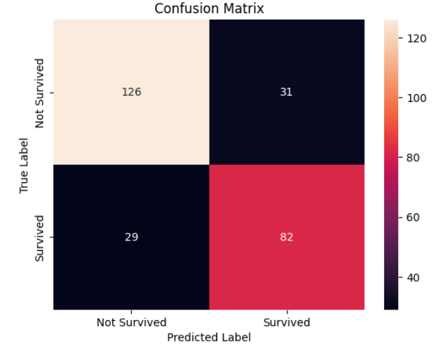

# Titanic Survival Prediction using Gaussian Naive Bayes

## Project Description

This project focuses on predicting passenger survival from the sinking of the Titanic. It is a classic binary classification problem in data science, serving as an excellent introduction to the fundamentals of machine learning.

Using the well-known `titanic.csv` dataset, this notebook implements a complete machine learning pipeline. The workflow begins with data loading and exploratory data analysis (EDA) to understand passenger demographics and key features. This is followed by a robust preprocessing phase, which includes handling missing values (imputation for `age` and `fare`), feature engineering (one-hot encoding for `sex`), and feature scaling (`fare`).

The primary objective is to build and evaluate a **`Gaussian Naive Bayes`** (GNB) classifier. The model's performance is then assessed using standard classification metrics—including accuracy, precision, recall, and a confusion matrix—to determine its effectiveness in predicting survival.

---

## Dataset and Features

The model uses the following features to predict the target variable:

* **Target Variable:**
    * `survived`: Whether the passenger survived (1) or not (0).

* **Predictor Features:**
    * `p_class`: The passenger class (1, 2, or 3).
    * `sex`: The gender of the passenger.
    * `age`: The age of the passenger.
    * `fare`: The fare the passenger paid.

---

## Project Workflow

### 1. Data Preparation and Exploration
* The dataset was loaded, and irrelevant columns (`passenger_id`, `name`, `sib_sp`, `parch`, `ticket`, `cabin`, `embarked`) were dropped.
* Exploratory data analysis was performed to understand the data:
    * **Bar charts** were used to visualize the distribution of survivors (`survived`) and passenger class (`p_class`).
    * A **pie chart** was used to show the gender distribution (`sex`).
    * **Histograms** were used to understand the distribution of `age` and `fare`.

### 2. Data Preprocessing
To prepare the data for the model, the following steps were taken:
* **Missing Values**: Missing `age` and `fare` values were filled using their respective **median** values.
* **Encoding**: The categorical `sex` column was converted into a numerical format (`sex_male`) using one-hot encoding.
* **Scaling**: The `fare` column was standardized using `StandardScaler` to ensure all features are on a comparable scale.

### 3. Model Training
* The preprocessed dataset was split into training (70%) and testing (30%) sets.
* A `Gaussian Naive Bayes` model was initialized and trained on the training data.

---

## Results and Conclusion

The model was evaluated on the unseen test data, achieving an **accuracy of 78%**.

The classification report provides a detailed look at precision and recall:
* **Not Survived (0)**: 81% Precision, 80% Recall
* **Survived (1)**: 73% Precision, 74% Recall

The confusion matrix below visualizes the model's correct and incorrect predictions:



This shows that the `Gaussian Naive Bayes` model provides a solid baseline for predicting survival, correctly identifying the majority of both survivors and non-survivors.

---

## How to Run

### Dependencies
To run the `Titanic Survival Prediction.ipynb` notebook, you will need the following Python libraries installed:

* pandas
* seaborn
* matplotlib
* scikit-learn

You can install them using pip:
```bash
pip install pandas seaborn matplotlib scikit-learn
